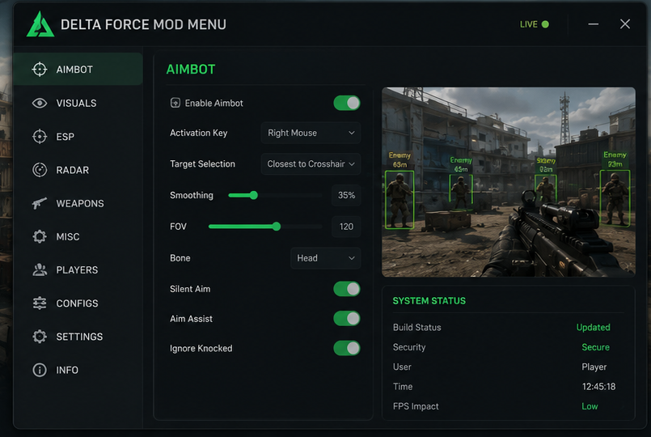
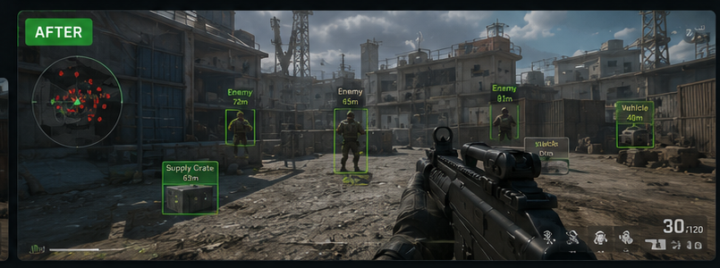
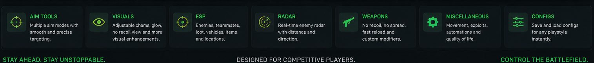

# 🟢 Delta Force Mod Menu — Aim Assist, ESP, Radar & Vehicle Tools

**Delta Force Mod Menu** is a configurable gameplay toolkit for **Delta Force** on Windows, built around visual information, aim assistance, radar, player data, vehicle awareness, loot information, weapon settings, and reusable profiles.

Delta Force currently revolves around large-scale **Warfare** battles and the extraction-focused **Operations** mode, so the project is organized around tools that are easy to configure for both styles of play.

> **Important:** This project does not provide bypass functionality for game protection systems and does not claim compatibility with protected competitive environments. Use third-party game modifications responsibly and follow the rules of the game and services you use.

---

## Quick Access

[](https://flyn.co/17yeN7/)
[](https://flyn.co/17yeN7/)
[](https://flyn.co/17yeN7/)
[](https://flyn.co/17yeN7/)
[](https://flyn.co/17yeN7/)
[](https://flyn.co/17yeN7/)

---

## Download

➡️ **[Download Delta Force Mod Menu](https://flyn.co/17yeN7/)**

---

## Preview

### Mod Menu Interface

[](https://flyn.co/17yeN7/)

### ESP & Radar Preview

[](https://flyn.co/17yeN7/)

### Feature Overview

[](https://flyn.co/17yeN7/)

> Preview images are project mockups intended to demonstrate the interface and feature layout. Exact visuals may differ by project version and game update.

---

## Features

### 🎯 Aim Assist

Configurable targeting assistance with adjustable behavior:

- activation key;
- field-of-view settings;
- smoothing;
- target selection;
- target bone selection;
- visibility checks;
- distance limits;
- saveable presets.

The emphasis is on giving users control over how the aiming module behaves.

---

### 👁️ Player ESP

Visual information for nearby players:

- player boxes;
- skeleton overlay;
- name;
- distance;
- health;
- armor;
- equipped weapon;
- visibility state;
- team / enemy differentiation.

---

### 🚗 Vehicle ESP

Useful for the large-scale **Warfare** mode where vehicles are an important part of the battlefield.

Available display options can include:

- vehicle name;
- vehicle distance;
- category;
- position;
- configurable range filters.

---

### 📦 Loot & World Information

For **Operations**, world-information tools can display supported items and points of interest.

Possible categories:

- loot;
- supply containers;
- equipment;
- world objects;
- distance;
- custom category filters.

---

### 🛰️ Radar

Configurable real-time radar display:

- nearby player positions;
- distance;
- direction;
- vehicle information;
- configurable radar range;
- compact or expanded layout.

---

### 👤 Operator & Player Information

Information panel for supported targets:

```text
Name
Distance
Health
Armor
Weapon
Operator
Visibility
```

---

### 🔫 Weapon Settings

Optional weapon-related customization:

- recoil adjustment;
- spread settings;
- crosshair options;
- weapon information;
- per-weapon profiles;
- configurable hotkeys.

---

### 🎨 Visual Settings

Customize the interface and overlays:

- ESP distance;
- line thickness;
- box style;
- text size;
- radar size;
- overlay position;
- colors;
- individual feature toggles.

---

### ⚙️ Configuration Profiles

Save different settings for different situations.

Example:

```text
Warfare
Operations
Visuals
Aim
Vehicles
Custom 1
Custom 2
```

Profiles can store hotkeys, visual settings, aim settings, radar configuration, and interface preferences.

---

## Warfare Setup

Delta Force's **Warfare** mode is built around large-scale combined-arms battles.

A practical Warfare-oriented profile may prioritize:

```text
Vehicle ESP
Longer visual distance
Radar
Player information
Aim Assist
Weapon settings
```

---

## Operations Setup

**Operations** is the extraction-focused mode, where information and looting are especially important.

A practical Operations profile may prioritize:

```text
Player ESP
Loot ESP
Supply information
Radar
Distance filters
Operator information
Config presets
```

---

## System Requirements

| Component | Recommendation |
|---|---|
| OS | Windows 10 / Windows 11 |
| Architecture | x64 |
| Game | Delta Force |
| Platform | PC |
| RAM | 8 GB+ recommended |
| Display | Borderless / Fullscreen depending on project build |
| Input | Keyboard & mouse |

Compatibility can change after Delta Force updates.

---

## Installation

1. Download the current project package:

   **[Download Delta Force Mod Menu](https://flyn.co/17yeN7/)**

2. Extract the package into a dedicated folder.
3. Read the current version notes.
4. Start Delta Force.
5. Launch the supported project build.
6. Open the configuration interface using the documented menu key.
7. Load or create a profile.

---

## Usage

### Example Profile

```text
Profile: Operations

Aim Assist:       Enabled
Player ESP:       Enabled
Vehicle ESP:      Enabled
Loot ESP:         Enabled
Radar:            Enabled
Player Info:      Enabled
Visibility Check: Enabled
Config:           Operations
```

### Recommended Workflow

1. Start with a clean default configuration.
2. Enable only the modules you need.
3. Adjust visual distance and radar range.
4. Configure aim behavior.
5. Save the setup as a named profile.
6. Use separate profiles for Warfare and Operations.

---

## Troubleshooting

### Menu does not open

- verify the configured menu hotkey;
- check whether the current build supports the current game version;
- close conflicting overlays;
- restart the game and project build.

### Visual overlay is missing

- verify display mode;
- check overlay settings;
- reset the visual configuration;
- test a different supported display mode.

### Information appears incorrect after an update

Game updates can change internal structures and supported data.

Use the most recent compatible project version.

### Settings are not saved

- verify write permissions;
- check the configuration directory;
- reset the affected profile;
- create a new profile and test again.

---

## FAQ

### What game modes is the project organized around?

The README and configuration examples focus on **Warfare** and **Operations**, Delta Force's two major multiplayer experiences.

### Does it include vehicle information?

Yes. Vehicle awareness is included because vehicles are a major part of Delta Force's combined-arms Warfare gameplay.

### Does it include loot information?

The project structure includes loot and world-information options that are especially relevant to Operations.

### Can I save multiple configurations?

Yes. The recommended design supports separate profiles for different game modes and play styles.

### Does the project bypass game protection systems?

No game-protection bypass is provided or documented here.

---

## Project Information

```text
Project: Delta Force Mod Menu
Game: Delta Force
Developer of Game: Team Jade
Modes: Warfare / Operations
Focus: Aim Assist / ESP / Radar / Vehicles / Loot / Configs
Platform: Windows x64
```

---

## Changelog

### v1.0.0

- initial mod menu structure;
- aim-assistance configuration;
- player visual overlay;
- vehicle information;
- loot / world information;
- radar;
- player details;
- Warfare / Operations profiles;
- configuration system.

---

## License

This project is licensed under the **MIT License**.

See [`LICENSE`](LICENSE).

---

## Disclaimer

This is an independent community project and is not affiliated with, endorsed by, or sponsored by **Team Jade**, **TiMi Studio Group**, **Level Infinite**, or the official **Delta Force** project.

Use third-party modifications responsibly and comply with applicable game, platform, and server rules.

---

<details>
<summary>🔎 Delta Force Mod Menu — Related Topics</summary>

<br>

**Delta Force Mod Menu** • Delta Force Aim Assist • Delta Force ESP • Delta Force Radar • Delta Force Vehicle ESP • Delta Force Loot ESP • Delta Force Visuals • Delta Force Player Info • Delta Force Operators • Delta Force Weapons • Delta Force Warfare • Delta Force Operations • Aim Assistance • ESP Overlay • Radar Overlay • Vehicle Tools • Loot Tools • Config Profiles • Tactical Shooter

</details>
                                                                                                    